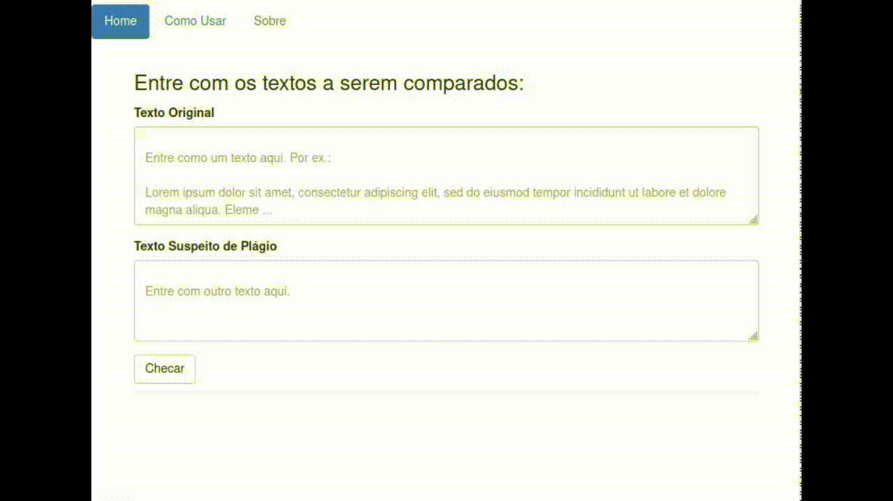

### Navegue online: https://checaplagio-1-a4780033.deta.app/

## Como rodar

**1. Acessar o endereço onde o APP está rodando:**
- Abrir navegador web e entrar em `https://checaplagio-1-a4780033.deta.app/`.

**2. Executar uma requisição:**
 - Inserir `texto original` e `texto suspeito de plágio` na aba `Home` em `https://checaplagio-1-a4780033.deta.app/`.
 - Clicar no botão `Checar`.

 **3. Na asba `Como usar` do APP (`https://checaplagio-1-a4780033.deta.app/how_to`) há exemplos para ajudar.**


<hr>

## Como rodar localmente

**1. Criar um ambiente local Python para instalar os pré-requesitos do APP:**
```shell
python -m venv venv
source venv/bin/activate
```

**2. Instalar as dependências:**
```shell
pip install -r requeriments.txt
```

**3. Rodar o APP:**
```shell
python main.py
```

**4. Acessar o localhost (onde o APP está rodando) `0.0.0.0:8080`:**
- Abrir navegador web e entrar em `0.0.0.0:8080`.

**5. Executar uma requisição:**
 - Inserir `texto original` e `texto suspeito de plágio` na aba `Home` em `0.0.0.0:8080`.
 - Clicar no botão `Checar`.

<hr>

